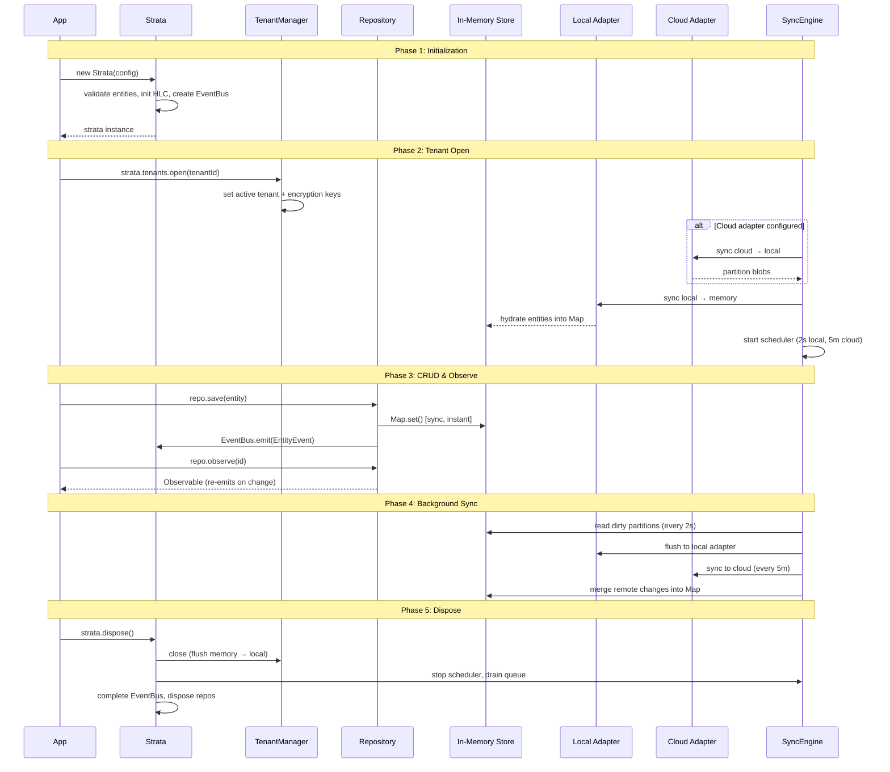

# Getting Started

## Installation

```bash
npm install @fyre-db/core
```

## Quick Start

```typescript
import { Strata, MemoryStorageAdapter, defineEntity } from '@fyre-db/core';

// 1. Define your entities
type Task = { title: string; done: boolean };
const taskDef = defineEntity<Task>('task');

// 2. Create a Strata instance
const strata = new Strata({
  appId: 'my-app',
  entities: [taskDef],
  localAdapter: new MemoryStorageAdapter(),
  deviceId: 'device-1',
});

// 3. Create and open a tenant
const tenant = await strata.tenants.create({
  name: 'My Workspace',
  meta: {},
});
await strata.tenants.open(tenant.id);

// 4. Use the repository
const tasks = strata.repo(taskDef);
const id = tasks.save({ title: 'Hello Strata', done: false });
console.log(tasks.get(id));        // { title: 'Hello Strata', done: false, id: '...', ... }
console.log(tasks.query().length); // 1

// 5. Clean up
await strata.dispose();
```

## Core Concepts

### Entities

Entities are typed data objects. You define them with `defineEntity<T>(name)`:

```typescript
type Note = { body: string; tags: string[] };
const noteDef = defineEntity<Note>('note');
```

The framework adds metadata fields automatically: `id`, `createdAt`, `updatedAt`, `version`, `device`, and `hlc` (hybrid logical clock for sync).

### Tenants

All data is scoped to a tenant. A tenant represents a workspace, project, or user account. You must create and open a tenant before reading or writing data.

```typescript
const tenant = await strata.tenants.create({ name: 'Work', meta: {} });
await strata.tenants.open(tenant.id);
```

### Repositories

Repositories provide CRUD operations. Get one from `strata.repo(entityDef)`:

```typescript
const repo = strata.repo(taskDef);

// Create
const id = repo.save({ title: 'Buy milk', done: false });

// Read
const task = repo.get(id);

// Update (pass the id to update)
repo.save({ ...task!, done: true });

// Delete
repo.delete(id);

// Query
const open = repo.query({ where: { done: false } });
```

### Adapters

Adapters determine where data is stored. The framework ships `MemoryStorageAdapter` for development and testing — it stores raw `Uint8Array` bytes in an in-memory `Map`.

For production, use an adapter from `fyre-db/plugins` (e.g., `LocalStorageAdapter`, `GoogleDriveAdapter`) or implement the `StorageAdapter` interface for your own backend. See [Storage Adapters](storage-adapters.md).

## StrataConfig

```typescript
const strata = new Strata({
  appId: 'my-app',                    // unique app identifier
  entities: [taskDef, noteDef],       // entity definitions
  localAdapter: myStorageAdapter,     // StorageAdapter implementation
  cloudAdapter: myCloudAdapter,       // optional — enables cloud sync
  deviceId: 'device-1',              // unique per device
  encryptionService: myEncryption,    // optional — enables per-tenant encryption
  migrations: [...],                  // optional — blob migrations
  options: {
    localFlushIntervalMs: 2000,       // memory → local flush interval (default: 2s)
    cloudSyncIntervalMs: 300000,      // local → cloud sync interval (default: 5m)
    tombstoneRetentionMs: 604800000,  // tombstone TTL (default: 7 days)
  },
});
```

## Lifecycle



## Next Steps

- [Entities & Repositories](entities-repositories.md) — key strategies, queries, batch ops
- [Reactive Observations](reactive.md) — observe changes with RxJS
- [Multi-Tenancy](multi-tenancy.md) — tenant management and sharing
- [Encryption](encryption.md) — per-tenant encryption
- [Sync & Offline](sync.md) — cloud sync and conflict resolution
- [Storage Adapters](storage-adapters.md) — custom adapter implementation
- [Migrations](migrations.md) — data schema migrations
